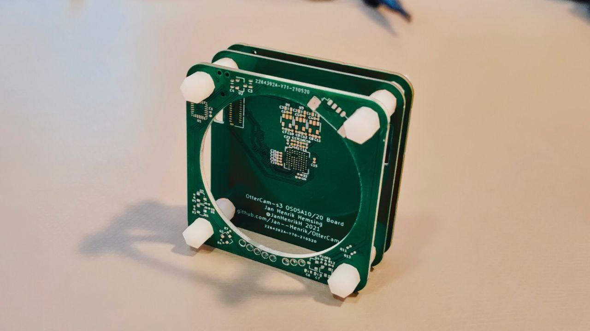
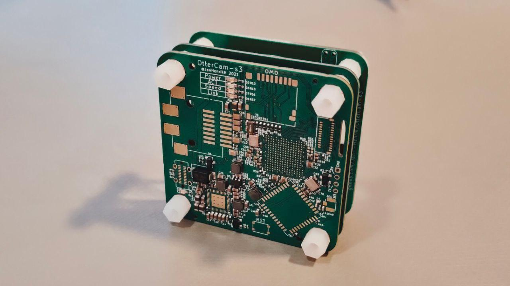
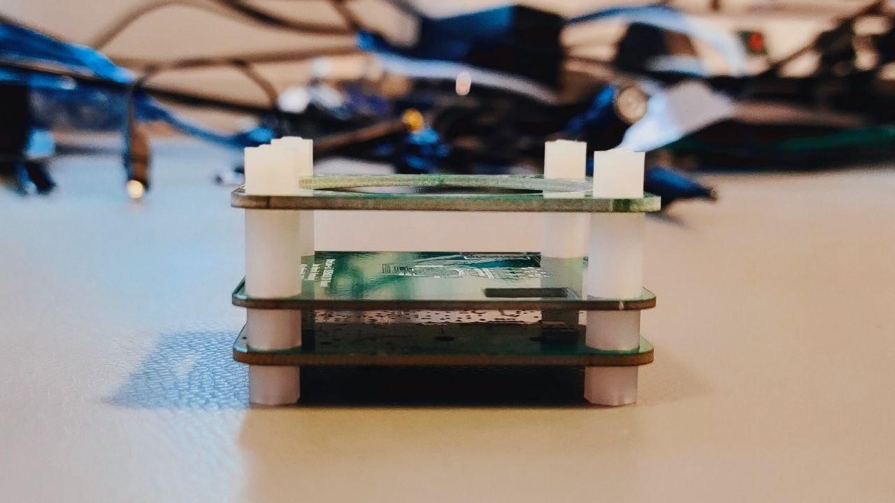

# OtterCam-s3

WIP USB/IP camera based on Sochip s3 and OS05A10/OS05A20 & general MIPI CSI IP camera interface. Does not burn nor boot, yet.

### Issues
 - [ ] MIPI Lanes Sensor are switched
 - [ ] No I2C Pullups
